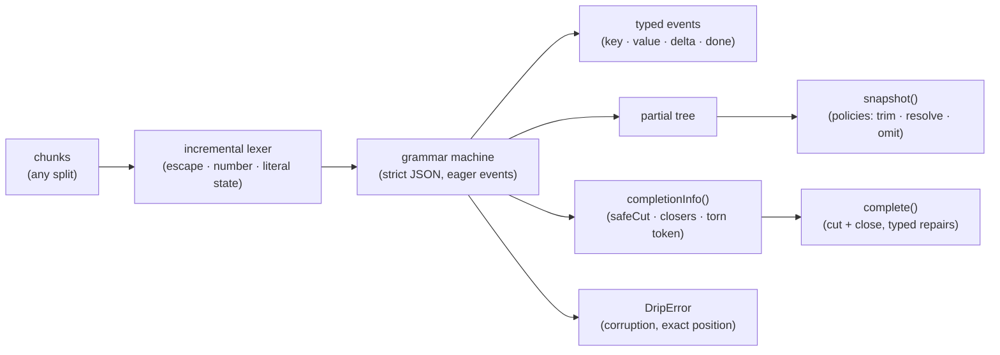

# dripjson

[English](README.md) | [中文](README.zh.md) | [日本語](README.ja.md)

[](LICENSE)   [](CONTRIBUTING.md)

**ストリーミングされる不完全な JSON のためのインクリメンタルパーサー：型付きイベント + ベストエフォート補完。**


```bash
# not yet on npm — install from a checkout of this repository
npm install && npm run build && npm pack
npm install -g ./dripjson-0.1.0.tgz
```

## なぜ dripjson？

ストリーミングされるツールコール引数は壊れた JSON プレフィックス——`{"city": "Osa`——として届き、どの SDK も同じ悲しい応急処置を手書きしている：正規表現で波括弧を数え、末尾に引用符を貼り付け、チャンクごとに `JSON.parse` をリトライして祈る。こうしたハックは、ストリームで実際に起きる境界（バックスラッシュで切れたエスケープ、16 進 2 桁で止まった `\uXXXX`、まだ伸びるかもしれない数値）でこそ壊れるうえ、プレフィックスに*何がある*かは語れず、全体がパースできるか否かしか言えない。clarinet や stream-json のようなストリーミングパーサーはチャンク処理を正しく解くが、切断をエラーとして扱い、修復済み文書は返さない；partial-JSON 系ヘルパーは値はくれるが、イベントもパスも修復テキストもなく、何を変えたかの説明もない。dripjson は本物のインフラとして作られた欠けていたピースだ：各フィールドが確定した瞬間に完全なパス付きの型付きイベントを発行し、任意のバイト時点でベストエフォートのスナップショットを返し、*カットして閉じる*——データを決して捏造しない——方式でプレフィックスを正しい JSON に修復し、すべての編集を報告する、単一のインクリメンタルパーサー。逆方向にも同じだけ厳格で、切断は第一級の状態だが、破損（`{"a" 1}`、`[1,]`）は正確な位置付きで例外を投げる。不正な入力を推測でごまかす回復パーサーは、ユーザーのデータを静かに書き換えてしまうからだ。これは高速な `JSON.parse` ではない；`JSON.parse` が*まだ*受け付けられない文書のためのパーサーである。

| | dripjson | 手書きの応急処置 | partial-JSON 系ヘルパー | clarinet / stream-json |
|---|---|---|---|---|
| フィールド確定即時の型付きイベント + パス | ✅ コア機能 | ❌ | ❌ 値のみ | ✅ イベントあり、パスは自前 |
| 切断プレフィックスのベストエフォート値 | ✅ ポリシー制御 | 🟡 脆い | ✅ | ❌ 切断はエラー |
| プレフィックスを正しい JSON *テキスト*に修復 | ✅ 型付き修復リスト付き | 🟡 引用符と括弧のみ、監査なし | ❌ | ❌ |
| エスケープ/数値内部のチャンク境界 | ✅ 全分割点でテスト | ❌ 定番のクラッシュ | — 文字列全体 API | ✅ |
| どう分割しても同じ結果 | ✅ プロパティテストで保証 | ❌ | — | 🟡 未検証 |
| 破損を推測せず拒否する | ✅ 正確な位置 | ❌ | 🟡 実装次第 | ✅ |
| ランタイム依存ゼロ・完全オフライン | ✅ | ✅ | ✅ | 🟡 実装次第 |

<sub>比較は各アプローチの公開ドキュメントと挙動に基づく（2026-07）。dripjson は意図的に*切断のみ*——正しい文書の任意のプレフィックス——を回復する。緩い方言（コメント、シングルクォート、`NaN`）はロードマップであり、デフォルトにはしない。正確な契約は [docs/recovery-rules.md](docs/recovery-rules.md) を参照。</sub>

## 特長

- **完全なパス付き型付きイベント** — `key`、`value`、`openArray`、`done`…各イベントはパス（`["arguments","filters","cabin"]`）で位置づけられ、文書を待たずフィールド確定の瞬間に行動できる；`pathToPointer()` はログ用に RFC 6901 ポインタを描画する。
- **どのチャンク境界でも安全** — 文字列、エスケープ（`\uXXXX` をどこで切っても）、数値、リテラルはあらゆる分割点をまたげる；テストスイートはフィクスチャを全境界で供給し、イベントがバイト単位で一致することを検証する。
- **任意の瞬間のベストエフォートスナップショット** — `snapshot()` はその時点の文書の深いコピーで互いに隔離されている；`12.` は `12` にトリム、`fal` は `false` に解決（リテラルの接頭辞はすべて一意）、宙ぶらりんのキーは削除——判断はすべて明示的で文書化されたポリシー。
- **データを捏造しない補完** — `complete()` はプレフィックスをバイト単位で保持し、救えない部分だけを切り戻し、文法が強制するものだけを追記し、各編集を型付き `Repair` として報告する；出力の再修復は不動点になる。
- **スナップショットと補完は常に一致** — すべてのプレフィックスで `JSON.parse(complete(p).text)` は `parsePartial(p).value` と深く等しく、全プレフィックスのプロパティテストで強制される。描画するものとパースするものが乖離しない。
- **切断 ≠ 破損** — どこで切れた文書でも回復する；どんな補完でも直せない入力は、マシンコードと正確な offset/line/column を持つ `DripError` を投げる。回復は不正データを決して推測しない。
- **ランタイム依存ゼロ・完全オフライン** — ライブラリは Node API を使わない素の ES2022；devDependency は `typescript` のみで、ネットワークには一切触れない。

## クイックスタート

同梱の例を修復する——文字列の途中、コンテナ 3 段の深さで切断されたツールコール：

```bash
dripjson complete examples/tool-call.partial.json
```

出力（実際にキャプチャした実行；修復リストは stderr へ）：

```text
{"name": "search_flights", "arguments": {"origin": "SFO", "destination": "NRT", "departure": "2026-08-14", "passengers": 2, "filters": {"max_stops": 1, "cabin": "premium"}}}
repair: closed-string
repair: closed-containers (}}})
```

ライブラリとしてストリーミング——文書の完成よりずっと前にフィールドへ行動する：

```js
import { DripParser, parsePartial } from "dripjson";

const parser = new DripParser({ stringDeltas: true });
for await (const chunk of modelStream) {
  for (const event of parser.push(chunk)) {
    if (event.type === "value" && event.path[0] === "name") {
      startPrefetch(event.value); // the tool name settled — go
    }
  }
  render(parser.snapshot()); // best-effort view of everything so far
}

// or the one-call form over an accumulated buffer:
const { value, complete } = parsePartial(buffer);
```

さらなるシナリオ——チャンク分割イベントストリーム、`--no-resolve`、status ゲート——は [examples/](examples/README.md) に。

## コマンド

| コマンド | 動作 | 主なオプション |
|---|---|---|
| `complete <file>` | 入力を正しい JSON に修復して出力 | `--json`（テキスト + 型付き修復） |
| `snapshot <file>` | ベストエフォートでパースした値を出力 | `--pretty`、`--no-resolve` |
| `events <file>` | 型付きイベントストリームを NDJSON で出力 | `--chunk <n>`、`--deltas` |
| `status <file>` | 完全性を報告；スクリプト向けゲート | `--json` |

入力はファイル、または `-`/省略で stdin。終了コードはスクリプトに優しい：`0` 成功/完全、`1` 不完全（`status`）または値なし、`2` 使い方の誤りまたは不正な（切断でない）JSON。

## 回復ポリシー

| オプション | デフォルト | 効果 |
|---|---|---|
| `onPartialNumber` | `"trim"` | `12.` → `12`、`3e` → `3`；`"omit"` は値を捨てる。 |
| `onPartialLiteral` | `"resolve"` | `tru` → `true`——接頭辞はすべて一意；`"omit"` は捨てる。 |
| `onDanglingKey` | `"omit"` | 値が届かなかったキーは消える；`"null"` なら null で残す。 |
| `stringDeltas` | `false` | 文字列値の成長に合わせて `delta` イベントを発行。 |
| `maxDepth` | `1000` | コンテナのネストを制限；超過は `max-depth` を投げる。 |

文字列の途中で切れたキーは常に削除される——その名前は知りようがない。終端状態の完全な表、「カットして閉じる」の設計理由、バッファを自前で持つ呼び出し側向けの `completionInfo()`/`assemble()` API は [docs/recovery-rules.md](docs/recovery-rules.md) に規定されている。

## アーキテクチャ



## ロードマップ

- [x] インクリメンタル字句解析器 + パーサー（型付きイベント、パス、文字列デルタ、分割不変性）、3 つの回復ポリシー付きスナップショット、型付き修復とスナップショット等価保証を持つ `complete()`、RFC 6901 ポインタ、`complete`/`snapshot`/`events`/`status` CLI、91 テスト + smoke スクリプト（v0.1.0）
- [ ] 寛容な方言オプション：コメント、シングルクォート、引用符なしキー、`NaN`/`Infinity`——すべて明示的オプトイン、決してデフォルトにしない
- [ ] ストリーミングバイト入力（`Uint8Array` チャンク + インクリメンタル UTF-8 デコード）
- [ ] パス購読：JSON Pointer を登録し、確定時にコールバック
- [ ] 非同期イテレータアダプタ：`for await (const event of drip(stream))`
- [ ] 設定可能な `complete()` ポリシー（現在はスナップショットのデフォルトに固定）
- [ ] npm への公開

完全なリストは [open issues](https://github.com/JaydenCJ/dripjson/issues) を参照。

## コントリビュート

コントリビュート歓迎。`npm install && npm run build` でビルドし、`npm test` と `bash scripts/smoke.sh`（`SMOKE OK` を出力すること）を実行する——このリポジトリは CI を持たず、上記の主張はすべてローカル実行で検証されている。[CONTRIBUTING.md](CONTRIBUTING.md) を読み、[good first issue](https://github.com/JaydenCJ/dripjson/issues?q=is%3Aissue+is%3Aopen+label%3A%22good+first+issue%22) を選ぶか、[ディスカッション](https://github.com/JaydenCJ/dripjson/discussions)を始めてほしい。

## ライセンス

[MIT](LICENSE)
