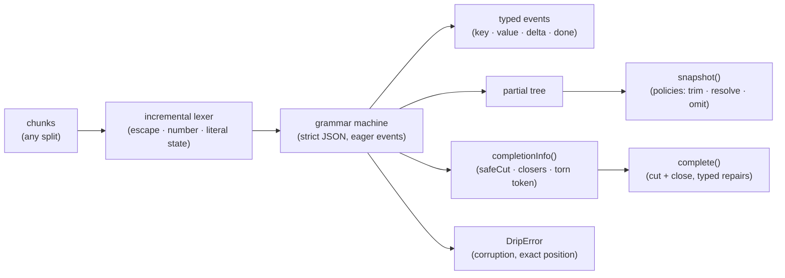

# dripjson

[English](README.md) | [中文](README.zh.md) | [日本語](README.ja.md)

[](LICENSE)   [](CONTRIBUTING.md)

**Incremental parser for streaming, partial JSON with typed events and best-effort completion.**


```bash
# not yet on npm — install from a checkout of this repository
npm install && npm run build && npm pack
npm install -g ./dripjson-0.1.0.tgz
```

## Why dripjson?

Streaming tool-call arguments arrive as broken JSON prefixes — `{"city": "Osa` — and every SDK hand-rolls the same sad fixup: count braces with a regex, slap quotes on the end, retry `JSON.parse` per chunk and hope. Those hacks break on the boundaries that actually occur in streams (an escape split at the backslash, a `\uXXXX` cut at two hex digits, a number that might still grow), and they can't tell you *what* is in the prefix, only whether the whole thing parses yet. Streaming parsers like clarinet or stream-json solve chunking properly but treat truncation as an error and give you no repaired document; partial-JSON helpers give you a value but no events, no paths, no repaired text, and no account of what they changed. dripjson is the missing piece built as real infrastructure: one incremental parser that emits typed events with full paths the moment each field settles, serves a best-effort snapshot at any byte, and repairs a prefix into valid JSON by *cut and close* — never inventing data — with every edit reported. It is equally strict in the other direction: truncation is a first-class state, but corruption (`{"a" 1}`, `[1,]`) throws with an exact position, because a recovery parser that guesses around invalid input silently changes user data. It is not a faster `JSON.parse`; it is the parser for documents `JSON.parse` cannot accept *yet*.

| | dripjson | hand-rolled fixups | partial-JSON helpers | clarinet / stream-json |
|---|---|---|---|---|
| Typed events + paths as fields settle | ✅ the core feature | ❌ | ❌ value only | ✅ events, no paths for free |
| Best-effort value of a truncated prefix | ✅ policy-controlled | 🟡 fragile | ✅ | ❌ truncation is an error |
| Repairs a prefix into valid JSON *text* | ✅ with typed repair list | 🟡 quotes + braces, no audit | ❌ | ❌ |
| Chunk boundaries inside escapes/numbers | ✅ tested at every split | ❌ the classic crash | — whole-string API | ✅ |
| Same result however input is chunked | ✅ property-tested | ❌ | — | 🟡 unverified |
| Rejects corruption instead of guessing | ✅ exact position | ❌ | 🟡 varies | ✅ |
| Zero runtime dependencies, fully offline | ✅ | ✅ | ✅ | 🟡 varies |

<sub>Comparison against each approach's public docs and behavior, 2026-07. dripjson deliberately recovers *truncation only*: any prefix of a valid document. Looser dialects (comments, single quotes, `NaN`) are roadmap, not defaults. See [docs/recovery-rules.md](docs/recovery-rules.md) for the exact contract.</sub>

## Features

- **Typed events with full paths** — `key`, `value`, `openArray`, `done`… each addressed by path (`["arguments","filters","cabin"]`), so you can act on a field the moment it settles instead of waiting for the document; `pathToPointer()` renders RFC 6901 pointers for logs.
- **Any chunk boundary is safe** — strings, escapes (`\uXXXX` split anywhere), numbers and literals may straddle any split; the suite feeds fixtures at every boundary and asserts the events are byte-for-byte identical.
- **Best-effort snapshots at any moment** — `snapshot()` is a deep, isolated copy of the document so far; `12.` trims to `12`, `fal` resolves to `false` (every literal prefix is unambiguous), dangling keys drop — each judgment call an explicit, documented policy.
- **Completion that never invents data** — `complete()` keeps your prefix byte-for-byte, cuts back only what nothing could finish, appends only what the grammar forces, and reports every edit as a typed `Repair`; repairing the output again is a fixed point.
- **Snapshot and completion always agree** — `JSON.parse(complete(p).text)` deep-equals `parsePartial(p).value` for every prefix, enforced by an every-prefix property test, so what you render and what you parse never diverge.
- **Truncation ≠ corruption** — a document cut off anywhere is recovered; input no completion could make valid throws `DripError` with a machine code and exact offset/line/column. Recovery never guesses around invalid data.
- **Zero runtime dependencies, fully offline** — plain ES2022 with no Node APIs in the library; `typescript` is the sole devDependency, and nothing ever touches the network.

## Quickstart

Repair the bundled example — a tool call cut off mid-string, three containers deep:

```bash
dripjson complete examples/tool-call.partial.json
```

Output (real captured run; repairs go to stderr):

```text
{"name": "search_flights", "arguments": {"origin": "SFO", "destination": "NRT", "departure": "2026-08-14", "passengers": 2, "filters": {"max_stops": 1, "cabin": "premium"}}}
repair: closed-string
repair: closed-containers (}}})
```

As a library, streaming — act on fields long before the document completes:

```js
import { DripParser, parsePartial } from "dripjson";

const parser = new DripParser({ stringDeltas: true });
for await (const chunk of modelStream) {
  for (const event of parser.push(chunk)) {
    if (event.type === "value" && event.path[0] === "name") {
      startPrefetch(event.value); // the tool name settled — go
    }
  }
  render(parser.snapshot()); // best-effort view of everything so far
}

// or the one-call form over an accumulated buffer:
const { value, complete } = parsePartial(buffer);
```

More scenarios — chunked event streams, `--no-resolve`, the status gate — live in [examples/](examples/README.md).

## Commands

| Command | Does | Key options |
|---|---|---|
| `complete <file>` | print the input repaired into valid JSON | `--json` (text + typed repairs) |
| `snapshot <file>` | print the best-effort parsed value | `--pretty`, `--no-resolve` |
| `events <file>` | print the typed event stream as NDJSON | `--chunk <n>`, `--deltas` |
| `status <file>` | report completeness; the scriptable gate | `--json` |

Input is a file or `-`/omitted for stdin. Exit codes are script-friendly: `0` success/complete, `1` partial (`status`) or no value, `2` usage error or invalid (non-truncated) JSON.

## Recovery policies

| Option | Default | Effect |
|---|---|---|
| `onPartialNumber` | `"trim"` | `12.` → `12`, `3e` → `3`; `"omit"` drops the value instead. |
| `onPartialLiteral` | `"resolve"` | `tru` → `true` — every prefix is unambiguous; `"omit"` drops it. |
| `onDanglingKey` | `"omit"` | a key whose value never arrived disappears; `"null"` keeps it. |
| `stringDeltas` | `false` | emit `delta` events for string values as they grow. |
| `maxDepth` | `1000` | bound container nesting; exceeding it throws `max-depth`. |

A key cut off mid-string is always dropped — its name cannot be known. The full end-state table, the "cut and close" rationale and the `completionInfo()`/`assemble()` API for buffer-owning callers are specified in [docs/recovery-rules.md](docs/recovery-rules.md).

## Architecture



## Roadmap

- [x] Incremental lexer + parser (typed events, paths, string deltas, chunk-split invariance), snapshots with three recovery policies, `complete()` with typed repairs and the snapshot-equivalence guarantee, RFC 6901 pointers, `complete`/`snapshot`/`events`/`status` CLI, 91 tests + smoke script (v0.1.0)
- [ ] Tolerant dialect options: comments, single quotes, unquoted keys, `NaN`/`Infinity` — each opt-in, never default
- [ ] Streaming byte input (`Uint8Array` chunks with incremental UTF-8 decoding)
- [ ] Path subscriptions: register a JSON Pointer, get called back when it settles
- [ ] Async iterator adapter: `for await (const event of drip(stream))`
- [ ] Configurable `complete()` policies (currently fixed to the snapshot defaults)
- [ ] Publish to npm

See the [open issues](https://github.com/JaydenCJ/dripjson/issues) for the full list.

## Contributing

Contributions are welcome. Build with `npm install && npm run build`, then run `npm test` and `bash scripts/smoke.sh` (must print `SMOKE OK`) — this repository ships no CI, every claim above is verified by local runs. See [CONTRIBUTING.md](CONTRIBUTING.md), grab a [good first issue](https://github.com/JaydenCJ/dripjson/issues?q=is%3Aissue+is%3Aopen+label%3A%22good+first+issue%22), or start a [discussion](https://github.com/JaydenCJ/dripjson/discussions).

## License

[MIT](LICENSE)
