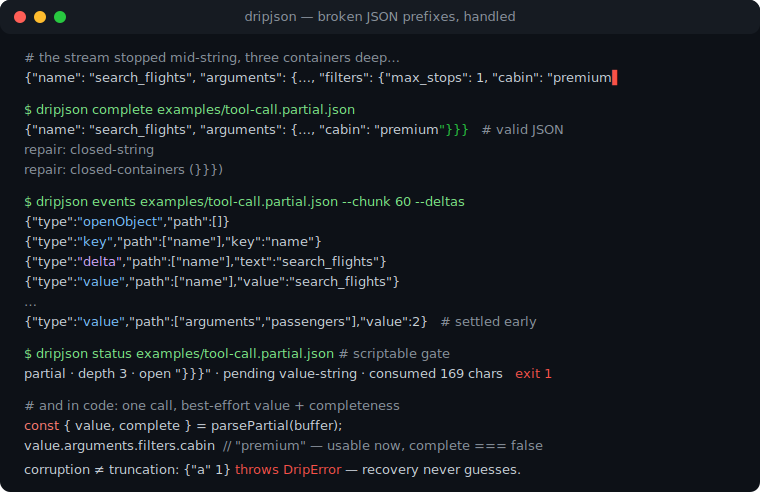
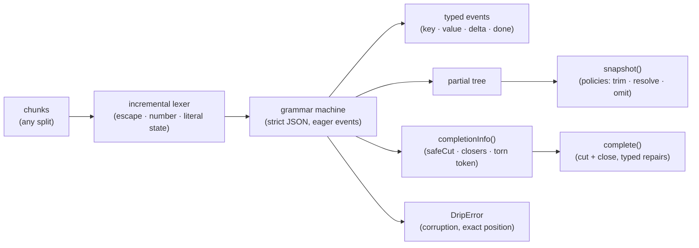

# dripjson

[English](README.md) | [中文](README.zh.md) | [日本語](README.ja.md)

[](LICENSE)   [](CONTRIBUTING.md)

**面向流式、不完整 JSON 的增量解析器：类型化事件 + 尽力而为的补全。**



```bash
# not yet on npm — install from a checkout of this repository
npm install && npm run build && npm pack
npm install -g ./dripjson-0.1.0.tgz
```

## 为什么选 dripjson？

流式工具调用参数总是以残缺的 JSON 前缀到达——`{"city": "Osa`——于是每个 SDK 都手搓同一套可悲的修补：用正则数大括号、往末尾硬拍引号、每收一块就重试 `JSON.parse` 并祈祷。这些 hack 恰恰会在流中真实出现的边界上崩掉（转义在反斜杠处被切断、`\uXXXX` 只到两位十六进制、数字还可能继续增长），而且它们说不出前缀里*有什么*，只能说整体是否已可解析。clarinet、stream-json 这类流式解析器正确解决了分块，却把截断当错误，也不给你修复后的文档；partial-JSON 类助手给你一个值，却没有事件、没有路径、没有修复文本，更不交代它改了什么。dripjson 是按真正基础设施打造的缺失一环：一个增量解析器，在每个字段落定的瞬间发出带完整路径的类型化事件，在任意字节处提供尽力而为的快照，并以*裁剪加闭合*——绝不凭空捏造数据——把前缀修复成合法 JSON，且每处修改都有记录。它在另一个方向同样严格：截断是一等状态，而损坏（`{"a" 1}`、`[1,]`）会抛出带精确位置的异常，因为在非法输入上瞎猜的恢复解析器会悄悄改动用户数据。它不是更快的 `JSON.parse`；它是为 `JSON.parse` *尚且*无法接受的文档准备的解析器。

| | dripjson | 手搓修补 | partial-JSON 助手 | clarinet / stream-json |
|---|---|---|---|---|
| 字段落定即发类型化事件 + 路径 | ✅ 核心特性 | ❌ | ❌ 只有值 | ✅ 有事件，路径要自己攒 |
| 截断前缀的尽力而为取值 | ✅ 策略可控 | 🟡 脆弱 | ✅ | ❌ 截断即报错 |
| 把前缀修复成合法 JSON *文本* | ✅ 附类型化修复清单 | 🟡 补引号加括号，无审计 | ❌ | ❌ |
| 转义/数字内部的分块边界 | ✅ 逐切点测试 | ❌ 经典崩溃点 | — 整串 API | ✅ |
| 无论怎么分块结果都一致 | ✅ 性质测试保证 | ❌ | — | 🟡 未验证 |
| 拒绝损坏而非瞎猜 | ✅ 精确位置 | ❌ | 🟡 视实现而定 | ✅ |
| 零运行时依赖、完全离线 | ✅ | ✅ | ✅ | 🟡 视实现而定 |

<sub>对比基于各方案公开文档与行为，2026-07。dripjson 刻意只恢复*截断*：即合法文档的任意前缀。更宽松的方言（注释、单引号、`NaN`）在路线图上，绝不做默认。精确契约见 [docs/recovery-rules.md](docs/recovery-rules.md)。</sub>

## 特性

- **带完整路径的类型化事件** — `key`、`value`、`openArray`、`done`…每个事件都按路径寻址（`["arguments","filters","cabin"]`），字段一落定就能行动，无需等整个文档；`pathToPointer()` 可为日志渲染 RFC 6901 指针。
- **任意分块边界都安全** — 字符串、转义（`\uXXXX` 在任意处切断）、数字与字面量都可以横跨任何切点；测试套件把夹具在每个边界喂入，并断言事件逐字节一致。
- **任意时刻的尽力而为快照** — `snapshot()` 返回当前文档的深拷贝且相互隔离；`12.` 修剪为 `12`，`fal` 解析为 `false`（每个字面量前缀都无歧义），悬空键被丢弃——每个取舍都是明确、有文档的策略。
- **绝不捏造数据的补全** — `complete()` 逐字节保留你的前缀，只裁掉无可挽救的部分，只追加语法所强制的内容，并把每处修改报告为类型化 `Repair`；对输出再次修复是不动点。
- **快照与补全永远一致** — 对每个前缀，`JSON.parse(complete(p).text)` 与 `parsePartial(p).value` 深度相等，由全前缀性质测试强制执行，你渲染的与你解析的永不分叉。
- **截断 ≠ 损坏** — 在任意位置截断的文档都能恢复；任何补全都救不了的输入会抛出 `DripError`，带机器码与精确的 offset/line/column。恢复绝不在非法数据上瞎猜。
- **零运行时依赖、完全离线** — 纯 ES2022，库内不用任何 Node API；`typescript` 是唯一 devDependency，永远不碰网络。

## 快速上手

修复内置示例——一个在字符串中途、三层容器深处被切断的工具调用：

```bash
dripjson complete examples/tool-call.partial.json
```

输出（真实捕获运行；修复清单打到 stderr）：

```text
{"name": "search_flights", "arguments": {"origin": "SFO", "destination": "NRT", "departure": "2026-08-14", "passengers": 2, "filters": {"max_stops": 1, "cabin": "premium"}}}
repair: closed-string
repair: closed-containers (}}})
```

作为库、流式使用——在文档完成之前就对字段行动：

```js
import { DripParser, parsePartial } from "dripjson";

const parser = new DripParser({ stringDeltas: true });
for await (const chunk of modelStream) {
  for (const event of parser.push(chunk)) {
    if (event.type === "value" && event.path[0] === "name") {
      startPrefetch(event.value); // the tool name settled — go
    }
  }
  render(parser.snapshot()); // best-effort view of everything so far
}

// or the one-call form over an accumulated buffer:
const { value, complete } = parsePartial(buffer);
```

更多场景——分块事件流、`--no-resolve`、status 关卡——见 [examples/](examples/README.md)。

## 命令

| 命令 | 作用 | 关键选项 |
|---|---|---|
| `complete <file>` | 打印修复成合法 JSON 的输入 | `--json`（文本 + 类型化修复） |
| `snapshot <file>` | 打印尽力而为解析出的值 | `--pretty`、`--no-resolve` |
| `events <file>` | 以 NDJSON 打印类型化事件流 | `--chunk <n>`、`--deltas` |
| `status <file>` | 报告完整性；可脚本化的关卡 | `--json` |

输入为文件，或 `-`/省略表示 stdin。退出码对脚本友好：`0` 成功/完整，`1` 不完整（`status`）或无值，`2` 用法错误或非法（非截断）JSON。

## 恢复策略

| 选项 | 默认值 | 效果 |
|---|---|---|
| `onPartialNumber` | `"trim"` | `12.` → `12`，`3e` → `3`；`"omit"` 则丢弃该值。 |
| `onPartialLiteral` | `"resolve"` | `tru` → `true`——每个前缀都无歧义；`"omit"` 则丢弃。 |
| `onDanglingKey` | `"omit"` | 值从未到达的键会消失；`"null"` 则以 null 保留。 |
| `stringDeltas` | `false` | 字符串值增长时发出 `delta` 事件。 |
| `maxDepth` | `1000` | 限制容器嵌套；超过即抛 `max-depth`。 |

在字符串中途被切断的键总是被丢弃——它的名字无从得知。完整的终止状态表、"裁剪加闭合"的设计理由，以及面向自持缓冲区调用方的 `completionInfo()`/`assemble()` API，均规范于 [docs/recovery-rules.md](docs/recovery-rules.md)。

## 架构



## 路线图

- [x] 增量词法器 + 解析器（类型化事件、路径、字符串增量、分块不变性）、三种恢复策略的快照、带类型化修复与快照等价保证的 `complete()`、RFC 6901 指针、`complete`/`snapshot`/`events`/`status` CLI、91 个测试 + smoke 脚本（v0.1.0）
- [ ] 宽松方言选项：注释、单引号、无引号键、`NaN`/`Infinity`——一律显式开启，绝不默认
- [ ] 流式字节输入（`Uint8Array` 分块 + 增量 UTF-8 解码）
- [ ] 路径订阅：注册一个 JSON Pointer，落定时回调
- [ ] 异步迭代器适配：`for await (const event of drip(stream))`
- [ ] 可配置的 `complete()` 策略（当前固定为快照默认值）
- [ ] 发布到 npm

完整列表见 [open issues](https://github.com/JaydenCJ/dripjson/issues)。

## 贡献

欢迎贡献。用 `npm install && npm run build` 构建，然后运行 `npm test` 和 `bash scripts/smoke.sh`（必须打印 `SMOKE OK`）——本仓库不带 CI，以上每条声明都由本地运行验证。参见 [CONTRIBUTING.md](CONTRIBUTING.md)，认领一个 [good first issue](https://github.com/JaydenCJ/dripjson/issues?q=is%3Aissue+is%3Aopen+label%3A%22good+first+issue%22)，或发起一场[讨论](https://github.com/JaydenCJ/dripjson/discussions)。

## 许可证

[MIT](LICENSE)
